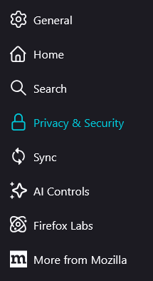
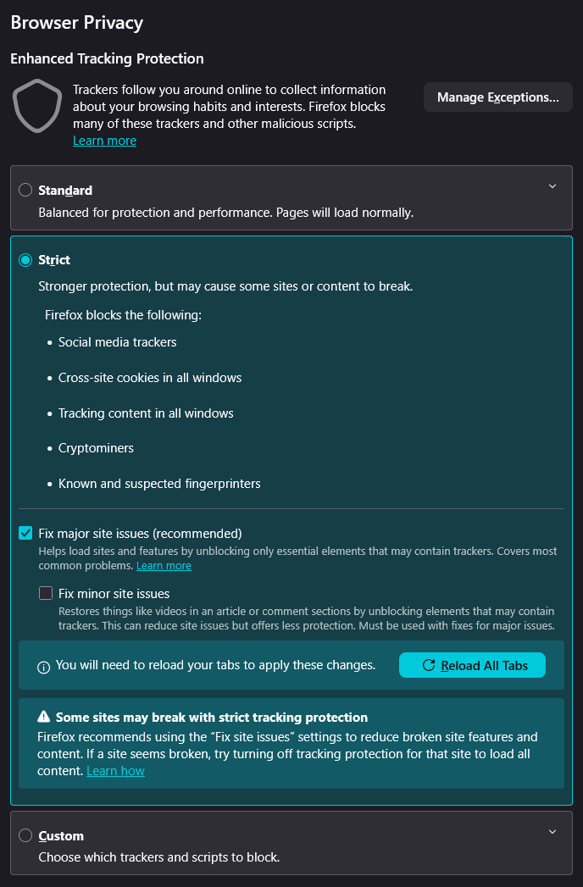
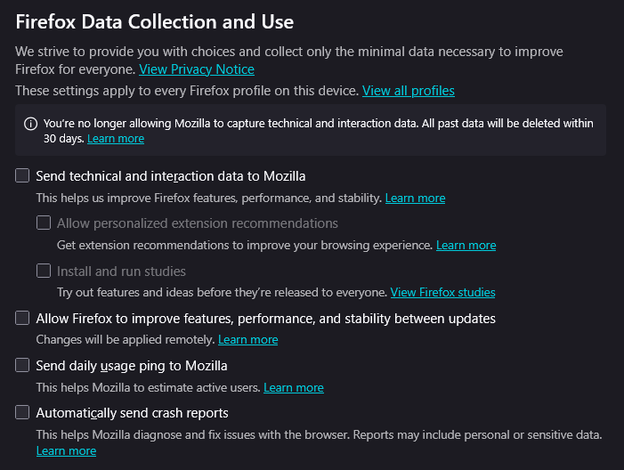
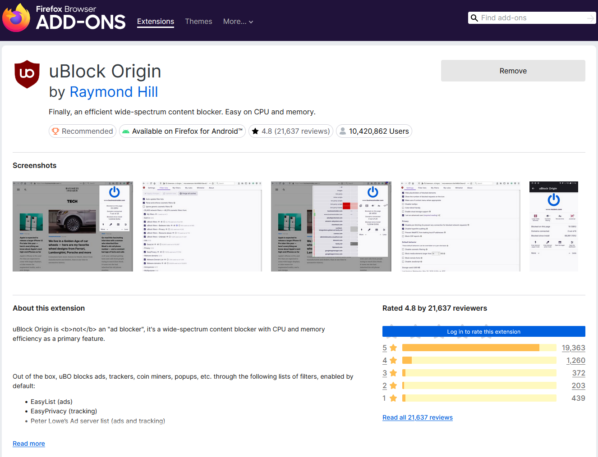
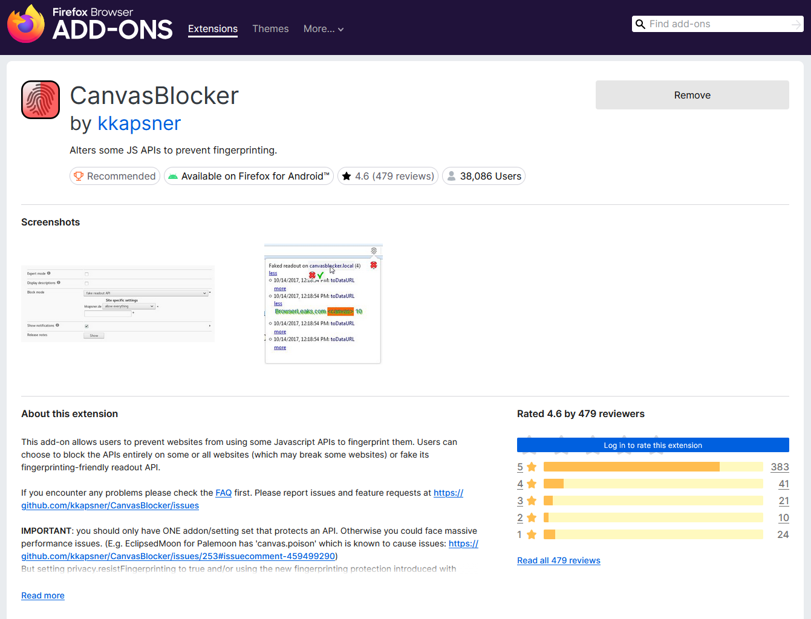
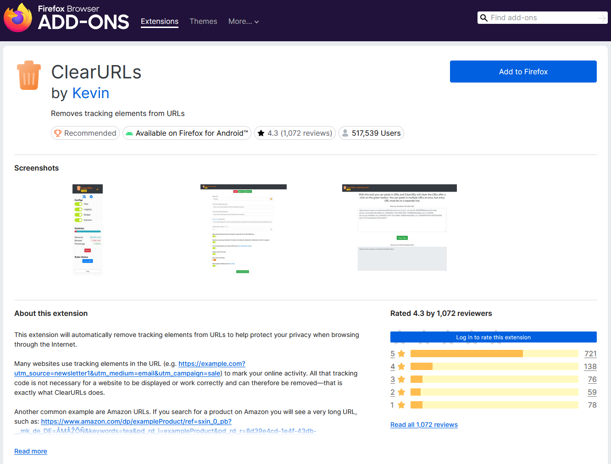
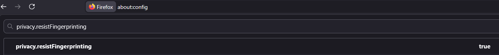
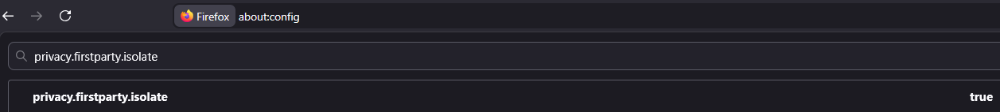
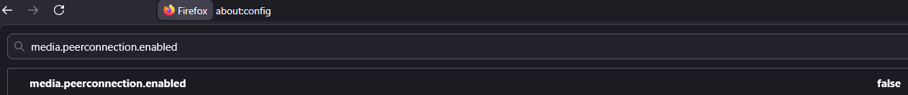

# Firefox Privacy & Hardening Guide

This guide provides a structured, step-by-step approach to configuring Mozilla Firefox for enhanced privacy, security, and tracking prevention. While Firefox is generally privacy-respecting out of the box, standard configurations still allow for some telemetry and tracking to maintain maximum web compatibility. This process, known as "hardening," significantly reduces your digital footprint.

### Important Notice: Functionality vs. Privacy
Hardening your browser inherently changes how it interacts with the web. By aggressively blocking trackers, isolating cookies, and resisting fingerprinting, you are likely to encounter functionality issues on certain websites. 
* Media embeds or interactive elements might fail to load.
* Single Sign-On (SSO) logins might be disrupted.
* You may encounter an increased number of CAPTCHAs.
* Browser-based WebRTC applications (like web-based video conferencing) may be disabled depending on your settings.

If a site breaks, you can temporarily disable the "Strict" tracking protection via the shield icon in the URL bar, or temporarily pause your content blocker.

---

## Table of Contents
1. [Level 1: Built-in UI Settings](#level-1-built-in-ui-settings)
2. [Level 2: Essential Extensions](#level-2-essential-extensions)
3. [Level 3: Advanced Configuration (about:config)](#level-3-advanced-configuration-aboutconfig)
4. [Level 4: Automated Configurations & Forks](#level-4-automated-configurations--forks)

---

## Level 1: Built-in UI Settings
These settings are accessible directly through the Firefox user interface and offer a solid baseline for privacy without requiring deep system modifications.

### 1. Privacy & Security Menu
Open the Firefox settings and navigate to the **Privacy & Security** panel. This is the central hub for data management.

  

### 2. Enhanced Tracking Protection
Change Enhanced Tracking Protection from **Standard** to **Strict**. 
This instructs Firefox to automatically block cross-site cookies in all windows, social media trackers, cryptominers, and known fingerprinting scripts. It is the most effective built-in tool to prevent third-party profiling.

  

### 3. Disable Telemetry and Data Collection
Browser developers use telemetry to gather technical data, interaction metrics, and crash reports. While often anonymized, minimizing outbound data is a core principle of privacy. Scroll down to **Firefox Data Collection and Use** and uncheck all boxes.

  

### 4. Change the Default Search Engine
A private browser is ineffective if your default search engine tracks your queries and builds a profile based on your interests. Go to the **Search** tab and change your Default Search Engine to a privacy-focused alternative like DuckDuckGo, Startpage, or Searx.

  

### 5. Cookies and Password Management (Usability Choice)
A common hardening practice is to delete all cookies upon closing the browser and to disable the built-in password manager entirely. However, this guide deliberately leaves these features enabled to maintain a balance between security and daily usability.

* **Cookie Retention:** Constantly re-rejecting cookie banners on every visit leads to "security fatigue," which can result in poor security decisions elsewhere.
* **Password Storage:** For many users, the built-in Firefox password manager (especially when protected by a **Primary Password**) is a safer alternative than using weak passwords or reusing them because they are too difficult to type manually every day.

By keeping these enabled, we ensure that the browser remains a viable tool for daily work while still benefiting from the significant privacy improvements in the other sections of this guide. If you wish to disable these, you can proceed to do so.

---

## Level 2: Essential Extensions
Installing too many extensions makes your browser more unique, increasing your fingerprinting risk. Limit your setup to these core tools, which cover the vast majority of tracking vectors.

### 1. uBlock Origin
A highly efficient wide-spectrum content blocker. It blocks malicious scripts, ads, and tracking domains at the network level before they can load, significantly reducing both bandwidth usage and tracking attempts. Ensure you install *uBlock Origin*, not "uBlock".

  

### 2. CanvasBlocker
Websites frequently utilize JavaScript APIs (such as the HTML5 Canvas) to render invisible graphics. The slight differences in how your specific hardware and graphics drivers render these graphics can be used to create a unique identifier for your device. CanvasBlocker spoofs this readout data, mitigating canvas fingerprinting.

  

### 3. ClearURLs
Analytics platforms often append tracking parameters to URLs (e.g., `?utm_source=...` or `?click_id=...`). ClearURLs operates in the background to automatically strip these non-essential parameters from links, ensuring that your navigation paths remain unlogged.

  

---

## Level 3: Advanced Configuration (`about:config`)
Firefox contains an advanced configuration menu that allows users to toggle deep system variables. 

**Accessing the menu:**
1. Type `about:config` in your URL bar and press Enter.
2. Accept the risk warning to proceed.
3. Use the search bar to locate the following preferences and double-click to modify them.

### 1. Resist Fingerprinting
Search for `privacy.resistFingerprinting` and set it to **true**.
This is a comprehensive anti-fingerprinting measure derived from the Tor Browser. It normalizes your system metrics by spoofing your timezone to UTC, limiting accessible system fonts, and reporting a generic window resolution.

  

### 2. First-Party Isolation
Search for `privacy.firstparty.isolate` and set it to **true**.
This restricts all cookies and temporary site data to the domain that created them. It effectively prevents third-party tracking networks from recognizing your session across different, unrelated websites.

  

### 3. Disable WebRTC (Prevent IP Leaks)
Search for `media.peerconnection.enabled` and set it to **false**.
WebRTC is a protocol used for real-time communication (like voice and video calls). However, it has a known vulnerability where it can expose your actual local and public IP addresses, even if you are routed through a VPN. Disabling this plugs the leak. *(Note: This breaks web-based video calling platforms).*

  

---

## Level 4: Automated Configurations & Forks
For users managing multiple machines or seeking the highest level of strictness, manual configuration can be inefficient. Consider these community-maintained alternatives:

* **[Arkenfox user.js](https://github.com/arkenfox/user.js)**: A comprehensive, security-focused configuration file. By placing this `user.js` file in your Firefox profile directory, it automatically enforces hundreds of privacy-centric `about:config` variables upon startup. 
* **[Betterfox](https://github.com/yokoffing/Betterfox)**: An alternative `user.js` project that balances privacy with performance. It aims to provide a smoother browsing experience by implementing fast, privacy-friendly settings that cause less site breakage than Arkenfox.
* **[LibreWolf](https://librewolf.net/)**: An independent, open-source fork of Firefox. It is compiled with telemetry entirely removed and comes pre-configured with uBlock Origin and Arkenfox-like settings out of the box, requiring zero initial configuration.

---
*By implementing these configurations, you significantly reduce the amount of data collected during your web sessions and establish a more secure browsing environment.*
